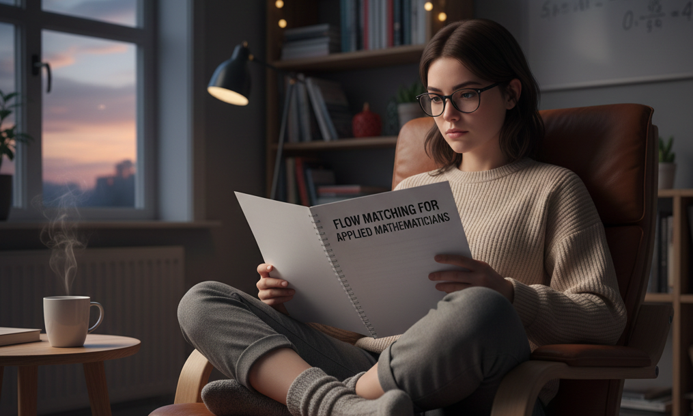

# Flow Matching for Applied Mathematicians
## Authors:
- Alasdair Newson
- Emile Pierret
Code for the paper:
"Flow Matching for Applied mathematicians", Emile Pierret, Valentine Tosel, Julie Delon, Alasdair Newson

In this repository, we have two sub-folders:
- "flow_matching_2": the code for Flow Matching implemented for 2D data,
- "flow_matching_image": the code for Flow Matching implemented on image data,
Please refer to each sub-folder's README for more details on how to use the code.
